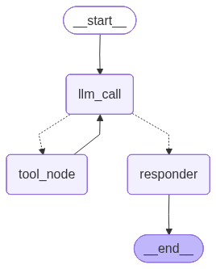

# 📈 Stock Market Investment Analyser & Predictor



A comprehensive AI-powered stock market analysis and prediction platform that combines technical analysis, sentiment analysis, and deep learning (RNN/LSTM) to provide intelligent investment recommendations. Now powered by a high-performance **FastAPI** backend and a modern web frontend.


## ✨ Features

### 🤖 AI-Powered Analysis
- **Multi-Agent System**: Built with LangGraph for intelligent decision-making and tool orchestration.
- **Sentiment Analysis**: Real-time news sentiment analysis using Groq-powered LLMs.
- **Technical Analysis**: Comprehensive technical indicators including RSI, Moving Averages (MA100, MA200), and EMA.
- **Fundamental Analysis**: Key metrics such as P/E ratio, market cap, beta, and profit margins.

### 📊 Advanced Visualizations
- **Interactive Charts**: Dynamic price action visualization.
- **Volume Analysis**: Trading volume trends to identify market momentum.
- **Model Performance**: Visual comparison of RNN predictions against actual historical prices.

### 🔮 Price Prediction
- **RNN/LSTM Deep Learning Model**: Neural network-based price forecasting for next-day closing prices.
- **Multi-Stock Support**: Analyze and predict multiple stocks (e.g., AAPL, NVDA, MSFT) simultaneously.

### 💎 Modern UI/UX
- **Premium Design**: Sleek, glassmorphism-inspired interface with responsive layouts.
- **Real-time Updates**: Fast and reactive interface powered by FastAPI.

## 🚀 Quick Start

### Prerequisites
- Python 3.8 or higher
- `pip` or `uv` package manager
- Virtual environment (recommended)

### Installation

1. **Clone the repository**
   ```bash
   git clone https://github.com/VashuTheGreat/Stock-Market-Investment-Analyser-Predictor.git
   cd Stock-Market-Investment-Analyser-Predictor
   ```

2. **Create and activate a virtual environment**
   ```bash
   python -m venv .venv
   # On Windows
   .venv\Scripts\activate
   # On macOS/Linux
   source .venv/bin/activate
   ```

3. **Install dependencies**
   ```bash
   pip install -r requirements.txt
   ```

4. **Set up environment variables**
   Create a `.env` file in the root directory:
   ```bash
   cp .env.example .env
   ```
   Add your API keys:
   ```env
   GROQ_API_KEY=your_groq_api_key_here
   ```

5. **Run the application**
   ```bash
   python main.py
   ```

6. **Open your browser**
   Navigate to `http://localhost:8000`

## 🏗️ Project Structure

```
Stock-Market-Investment-Analyser-Predictor/
├── api/                    # FastAPI Backend
│   ├── main.py             # FastAPI App initialization
│   ├── routes/             # API Endpoints
│   ├── static/             # CSS, JS, and Images
│   └── templates/          # HTML Templates (index.html)
├── src/                    # Core Logic
│   ├── RNN_Price_prediction/ # RNN/LSTM Model & Prediction Pipeline
│   └── Stock_Market/       # LangGraph Agents & Technical Analysis Tools
├── main.py                 # Entry point (runs uvicorn)
├── requirements.txt        # Python dependencies
├── graph.png               # Architecture Diagram
└── .env.example            # Environment variables template
```

## 🛠️ Technology Stack

- **Backend**: FastAPI, LangChain, LangGraph, Groq API (fast inference)
- **Data**: yFinance (real-time market data), Pandas, NumPy
- **Deep Learning**: TensorFlow/Keras (LSTM), Scikit-learn
- **Frontend**: Custom HTML5/CSS3 (Glassmorphism), Vanilla JavaScript

## 📊 Analysis Components

- **Trend Detection**: Uptrend, Downtrend, Sideways detection logic.
- **Sentiment Scoring**: AI-based classification of latest news impact.
- **Volatility Analysis**: Annualized price volatility metrics.

## 🎯 Key Features Explained

### Multi-Agent AI System
The application uses **LangGraph** to coordinate between different specialized agents:
1. **Collector**: Fetches technical and sentiment data.
2. **Analyzer**: Processes data to find patterns and trends.
3. **Strategist**: Generates the final BUY/SELL/HOLD recommendation with reasoning.

### RNN Price Forecasting
The prediction engine uses a Recurrent Neural Network (LSTM) trained on historical price data to forecast the next day's closing price, helping investors gauge short-term market direction.

## 🤝 Contributing
Contributions are welcome! Feel free to open an issue or submit a pull request.

## 📄 License
This project is licensed under the MIT License.

## ⚠️ Disclaimer
This tool is for educational purposes only. It is NOT financial advice. Always consult with a professional financial advisor.

---
**Made with ❤️ and AI**

For questions or feedback, please open an issue on GitHub.

---

**Made with ❤️ and AI**
